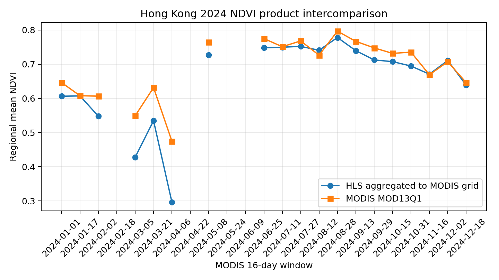
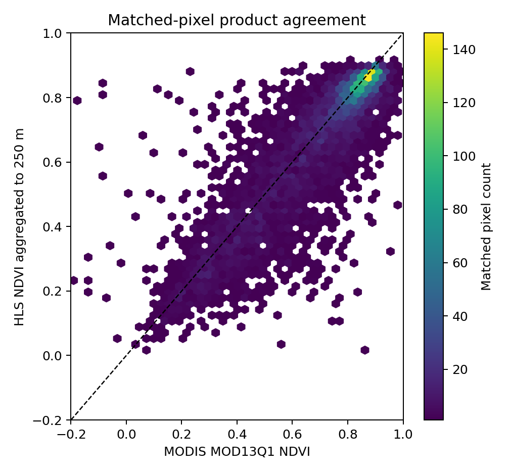
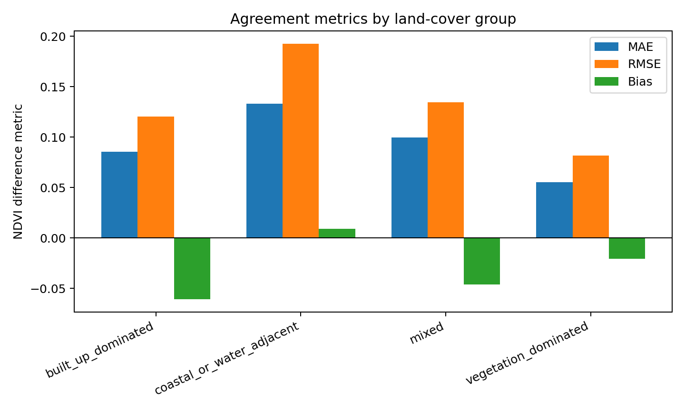
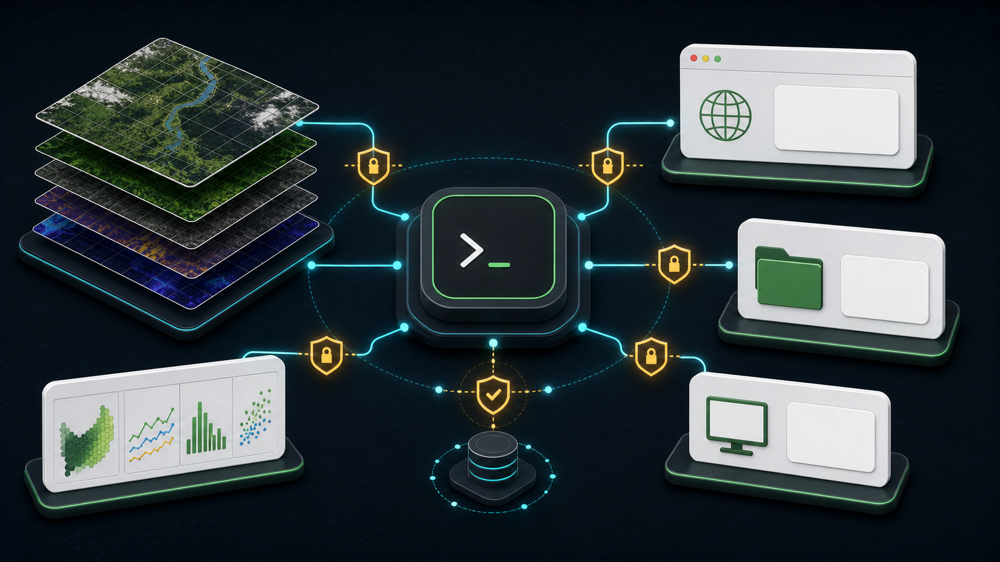
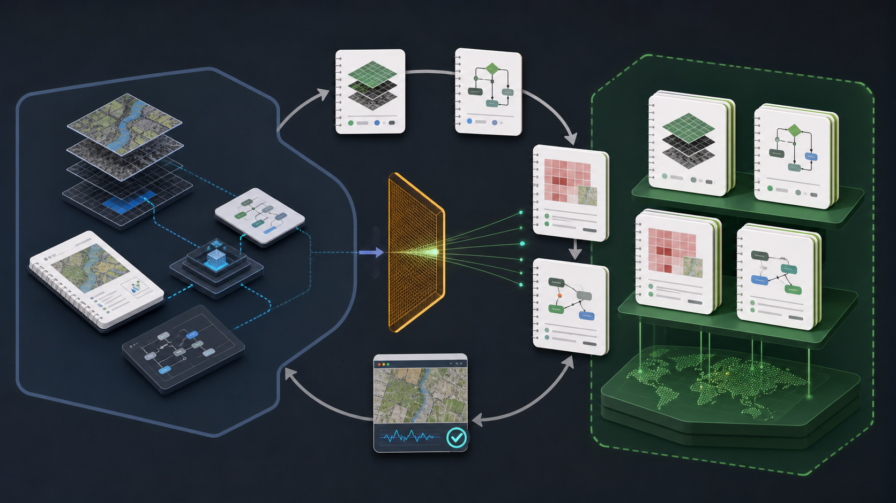

# gee-agent-skill


<p align="center">
  <a href="./README.md">English</a> ·
  <a href="./README.zh-CN.md">简体中文</a> ·
  <a href="https://github.com/Fwrog/gee-agent-skill">GitHub</a>
</p>

<p align="center">
  <a href="https://github.com/Fwrog/gee-agent-skill/actions"></a>
  <a href="./docs/capability_matrix.md"></a>
  <a href="./docs/tool_permissions.md"></a>
  <a href="./LICENSE"></a>
</p>

`gee-agent-skill` is an agent-native command-line harness for Google Earth Engine workflows. It helps Codex or another coding agent turn a geospatial request into a reviewable plan, source-grounded dataset/operator choices, validated Earth Engine Python, safe preflight checks, explicit confirmed exports, task monitoring, and reproducible traces.

## Project Snapshot

```text
natural language -> plan -> RAG evidence -> render -> validate -> preflight -> export -> monitor -> trace -> reusable knowledge
```

This repository is the public harness, not a private research workspace. Private research questions, unpublished findings, private asset ids, and draft manuscript content stay outside the public repo. Only generic lessons such as dataset cards, rule cards, failure cases, and workflow constraints should be promoted here.

| Layer | Public role |
| --- | --- |
| 🧭 Plan-first CLI | Converts a natural-language GEE task into a reviewable `gee-plan/v0.3` contract. |
| 📚 RAG evidence | Retrieves dataset, operator, recipe, rule, and failure cards before rendering code. |
| ✅ Validation gates | Blocks unsafe exports, missing bands, unresolved templates, placeholder AOIs, and overclaims. |
| 📤 Live execution | Uses the official Earth Engine Python API and requires `--project` plus `--confirm-live`. |
| 🧠 Learning loop | Promotes only generic, source-backed lessons after privacy review. |

## 5-Minute Quick Start

```bash
python -m venv .venv
source .venv/bin/activate
python -m pip install -e ".[earthengine]"

gee-skill smoke-test --json
gee-skill ask "Compute January 2024 mean NDVI for Hong Kong and export CSV." --dry-run --json
```

Live export is always opt-in and user-owned:

```bash
export EE_PROJECT="your-google-cloud-project-id"
earthengine authenticate --auth_mode=localhost
gee-skill preflight-plan outputs/runs/<run_id>/task_plan.yaml --project "$EE_PROJECT" --json
gee-skill run-plan outputs/runs/<run_id>/task_plan.yaml --project "$EE_PROJECT" --confirm-live --json
```

## 🧪 Public Demo Gallery

The public demos are small golden regression examples for the harness contract. They are not scientific vegetation products.

| Demo | Status | What it proves | Details |
| --- | --- | --- | --- |
| v0.1 minimal NDVI CSV | Golden | Minimal Sentinel-2 NDVI request -> plan -> validation -> preflight -> export trace. | [Case study](docs/case_studies/hk_ndvi_v01.md) |
| v0.2 land-cover-aware NDVI CSV | Golden | Dynamic World interpretation strata can be added with caveats and traceability. | [Case study](docs/case_studies/hk_ndvi_landcover_v02.md) |
| v0.3 HLS/MODIS NDVI product intercomparison | Golden | Scale-aware product consistency: HLS NDVI -> MODIS grid -> Drive export -> metrics/figures/report/readiness audit. | [Validation](docs/validation/hk_ndvi_product_intercomparison_v03.md) |

More complex academic demos are intentionally not displayed in this public README. Use the [capability matrix](docs/capability_matrix.md) for supported public surfaces and the [remote sensing validation ladder](docs/remote_sensing_validation.md) for generic NDVI reasonableness checks.

## Validation v0.3: Hong Kong NDVI Product Intercomparison

This v0.3 demo evaluates whether the skill can produce a scientifically plausible and reproducible NDVI workflow by comparing 30 m HLS-derived NDVI, aggregated to the MODIS grid, against the official MODIS MOD13Q1 vegetation-index product over Hong Kong. The experiment is designed as product intercomparison rather than in-situ validation: strong agreement supports workflow reliability, while systematic differences are analyzed by land-cover class, cloud coverage, and mixed-pixel effects.

| Component | Choice |
| --- | --- |
| High-resolution source | `NASA/HLS/HLSL30/v002` and `NASA/HLS/HLSS30/v002` |
| Official comparison product | `MODIS/061/MOD13Q1`, `NDVI * 0.0001` |
| Stratification | `ESA/WorldCover/v200` purity groups |
| Temporal logic | MODIS 16-day windows drive HLS collection windows |
| Scale logic | HLS 30 m median NDVI is aggregated to the MODIS projection before comparison |
| Drive handoff | `GEE_SKILL_V03_HK_NDVI_VALIDATION` |

Pipeline:

```text
discover datasets -> build GEE workflow -> HLS QA/NDVI -> MODIS QA/scale -> aggregate HLS to MODIS grid -> export to Drive -> connector readback -> metrics and figures
```

Current evidence status: `Golden` validation evidence is available for the public v0.3 demo. Full-year 2024 CSV exports were read back from Google Drive, annual GeoTIFF raster outputs were verified through native files or deterministic 2x2 tiled fallbacks, local QA passed, and the readiness audit reports `golden_ready`.

| Metric | Status |
| --- | --- |
| Matched pixel count | 5,575 matched full-year samples |
| Bias / MAE / RMSE | -0.025 / 0.073 / 0.111 NDVI |
| Pearson r / Spearman rho | 0.870 / 0.859 |
| Land-cover finding | Vegetation-dominated pixels have the lowest RMSE (0.082); coastal/water-adjacent pixels have the highest RMSE (0.193). |
| Raster QA | HLS 30 m, MODIS 250 m, HLS aggregated 250 m tiles, difference tiles, and valid-count tiles passed local sanity checks. |

**Why this analysis is credible**

- 🛰️ **Reference-like high-resolution input:** HLS v2.0 is designed to make Landsat/Sentinel-2 30 m surface reflectance comparable through atmospheric correction, cloud/cloud-shadow masking, BRDF/view-angle normalization, bandpass adjustment, and common gridding. The HLS v2.0 paper reports robust harmonization for quantitative terrestrial applications. [USGS/RSE](https://pubs.usgs.gov/publication/70266349)
- 🌿 **Official comparison product:** MOD13Q1 is the official 16-day 250 m MODIS vegetation-index product; the Earth Engine catalog and MOD13 user guide document atmospheric correction, QA layers, and the `0.0001` NDVI scale factor. [GEE catalog](https://developers.google.com/earth-engine/datasets/catalog/MODIS_061_MOD13Q1), [MOD13 guide](https://lpdaac.usgs.gov/documents/621/MOD13_User_Guide_V61.pdf)
- 📏 **Scale-aware validation:** The workflow does not compare 30 m HLS pixels directly with 250 m MODIS pixels. It aggregates HLS to the MODIS grid first, matching the validation logic recommended for moderate-resolution products where direct comparison is affected by scale mismatch and heterogeneity. [MODIS validation review](https://sites.bu.edu/cliveg/files/2013/12/ywze02.pdf)
- 🧭 **Interpretable error structure:** ESA WorldCover v200 provides a 10 m 2021 land-cover layer for stratification, so weaker coastal/mixed/built-up agreement is interpreted as a mixed-pixel and product-difference effect, not as a workflow failure. [GEE catalog](https://developers.google.com/earth-engine/datasets/catalog/ESA_WorldCover_v200)

**Conclusion:** v0.3 provides credible evidence that the skill can build a QA-aware, temporally matched, scale-aware NDVI product-intercomparison workflow. The strong correlations and low vegetation-dominated RMSE support workflow reliability; the larger coastal and mixed-pixel errors are expected remote-sensing behavior, not a contradiction. This remains product-level consistency evidence, not in-situ ground-truth accuracy.

Figures generated from Drive-downloaded CSVs:







Project status and remaining work are tracked in [Roadmap and TODO](docs/roadmap.md). The short contributor-facing task list is [TODO.md](TODO.md).

Reproduce:

```bash
python scripts/hk_ndvi_v03_export.py --mode smoke --year 2024 --drive-folder GEE_SKILL_V03_HK_NDVI_VALIDATION --project "$EE_PROJECT" --confirm-live --json
python scripts/hk_ndvi_v03_export.py --mode full --year 2024 --drive-folder GEE_SKILL_V03_HK_NDVI_VALIDATION --project "$EE_PROJECT" --confirm-live --json
python scripts/hk_ndvi_v03_monitor_tasks.py --manifest outputs/hk_ndvi_product_validation_v03/manifest.json --out outputs/hk_ndvi_product_validation_v03 --json
python scripts/hk_ndvi_v03_analyze_drive_exports.py --raw-dir outputs/hk_ndvi_product_validation_v03/raw_drive --out outputs/hk_ndvi_product_validation_v03 --json
python scripts/hk_ndvi_v03_make_figures.py --input outputs/hk_ndvi_product_validation_v03/analysis --out outputs/hk_ndvi_product_validation_v03/figures --json
python scripts/hk_ndvi_v03_readiness_audit.py --out outputs/hk_ndvi_product_validation_v03 --json
```

Limitations: this validates product-level consistency and remote-sensing workflow reliability, not ground-truth accuracy. Coastal mixed pixels, dense urban pixels, clouds, haze, terrain, BRDF differences, and static 2021 land-cover strata can all produce real product differences.

## 🔐 Tool Permissions



| Tool | Best use | Boundary |
| --- | --- | --- |
| Earth Engine Python API / `gee-skill` | GEE plan, render, validate, preflight, export, monitor, trace | Primary execution path; live export needs `--confirm-live`. |
| Browser | Official docs and dataset catalog verification, README visual QA | Do not submit exports through browser when API/CLI works. |
| Google Drive | Export handoff, zip/report/CSV/figure readback | Return only connector-observed links. |
| Data Analytics | Chart/report/data-quality validation after data exists | Does not replace remote-sensing domain review. |
| Computer Use | Local GUI fallback when no API/CLI/plugin path exists | Last resort, especially around credentials or live tasks. |
| imagegen | README/documentation raster visuals | Communication asset only, not scientific evidence. |

Full guidance: [Tool permissions](docs/tool_permissions.md).

## 🧠 Learning Loop



| Task-specific observation | Public generic form |
| --- | --- |
| A dataset path, band, or year range changed. | Dataset card with source URL, `last_checked`, scope, and caveats. |
| A live export failed because bands had mixed dtypes. | Failure case and rule: cast image export bands to a uniform dtype. |
| A public boundary substitute did not match an authority boundary. | Claim-boundary rule: do not state authoritative local conclusions. |
| A private research flow revealed repeated friction. | Generic workflow card only after privacy review and source verification. |

More detail: [Closed loop](docs/closed_loop.md) and [adaptive browser-backed knowledge loop](references/knowledge_base/workflows/adaptive-browser-backed-knowledge-loop.md).

## 🗺️ Roadmap And TODO

The public roadmap is maintained as a lightweight project board in [docs/roadmap.md](docs/roadmap.md). It separates `Done`, `Now`, `Next`, and `Later` work, and uses explicit status labels: `Golden`, `Partial`, `Implementation-ready`, `Planned`, and `Blocked`.

Use it to see what still needs work before a demo becomes public golden evidence. Current priorities are turning the completed v0.3 HLS/MODIS validation into generic v0.4 skill-generation capability, keeping release checks reproducible, and promoting only privacy-reviewed, source-backed lessons into the knowledge base.

For GitHub-style maintenance, use [TODO.md](TODO.md), the issue templates under `.github/ISSUE_TEMPLATE/`, and the suggested labels in `.github/labels.yml`. The board process, labels, triage loop, and demo promotion rules are summarized in [Project Board Guide](docs/project_board.md).

## What This Project Does

- parses supported natural-language GEE tasks into reviewable plans;
- retrieves local dataset, operator, recipe, rule, and failure evidence;
- renders approved Jinja2 Earth Engine Python templates;
- validates scripts before live use;
- runs dry-run and preflight checks before export;
- submits live exports only after explicit `--confirm-live`;
- monitors export tasks and records traces under `outputs/runs/<run_id>/`;
- keeps public knowledge generic and private research content out of GitHub.

## Agent-Native Interface

Core commands return deterministic JSON for agent orchestration:

```bash
gee-skill info --json
gee-skill doctor --json
gee-skill catalog search "Sentinel-2 NDVI" --json
gee-skill catalog evidence --category dataset --json
gee-skill recipe list --json
gee-skill plan from-text "Compute NDVI for a supplied AOI in March 2024 and export CSV." --json
gee-skill render <plan.yaml> --script-out <script.py> --json
gee-skill validate <script.py> --json
gee-skill preflight <plan.yaml> --project "$EE_PROJECT" --json
gee-skill run <plan.yaml> --project "$EE_PROJECT" --confirm-live --json
gee-skill exports list --project "$EE_PROJECT" --json
gee-skill trace inspect <run_id> --json
gee-skill eval evals/benchmark_suite.yml --json
```

Compatibility commands such as `ask`, `review-plan`, `preflight-plan`, `run-plan`, and `monitor-exports` remain available for existing public examples.

## Documentation

- [How to start](docs/how_to_start.md)
- [Demo gallery](docs/demo_gallery.md)
- [Tool permissions](docs/tool_permissions.md)
- [Closed loop](docs/closed_loop.md)
- [Remote sensing validation ladder](docs/remote_sensing_validation.md)
- [Capability matrix](docs/capability_matrix.md)
- [Project board guide](docs/project_board.md)
- [Roadmap and TODO](docs/roadmap.md)
- [CLI reference](docs/cli_reference.md)
- [Recipe registry](docs/recipes.md)
- [Benchmark protocol](docs/benchmark_protocol.md)
- [Troubleshooting](docs/troubleshooting.md)
- [Extending workflows](docs/extending.md)

## References and Data Sources

- [Earth Engine Python API](https://developers.google.com/earth-engine/guides/python_install)
- [Earth Engine authentication](https://developers.google.com/earth-engine/guides/auth)
- [Sentinel-2 SR Harmonized](https://developers.google.com/earth-engine/datasets/catalog/COPERNICUS_S2_SR_HARMONIZED)
- [MODIS Terra Vegetation Indices MOD13Q1](https://developers.google.com/earth-engine/datasets/catalog/MODIS_061_MOD13Q1)
- [MODIS Aqua Vegetation Indices MYD13Q1](https://developers.google.com/earth-engine/datasets/catalog/MODIS_061_MYD13Q1)
- [Landsat 8 Collection 2 Level 2](https://developers.google.com/earth-engine/datasets/catalog/LANDSAT_LC08_C02_T1_L2)
- [Landsat 9 Collection 2 Level 2](https://developers.google.com/earth-engine/datasets/catalog/LANDSAT_LC09_C02_T1_L2)
- [Dynamic World V1](https://developers.google.com/earth-engine/datasets/catalog/GOOGLE_DYNAMICWORLD_V1)
- [ESA WorldCover](https://developers.google.com/earth-engine/datasets/catalog/ESA_WorldCover_v200)
- [JRC Global Surface Water](https://developers.google.com/earth-engine/datasets/catalog/JRC_GSW1_4_GlobalSurfaceWater)

The local knowledge base under `references/knowledge_base/` contains distilled guidance. Official Earth Engine documentation remains canonical.

## Security

Live Earth Engine runs require your own Earth Engine account, Google Cloud Project, and local OAuth authentication. Never commit service account JSON files, OAuth tokens, local credential files, refresh tokens, credential paths, private keys, client secrets, private asset ids, draft manuscripts, or unpublished research outputs.
