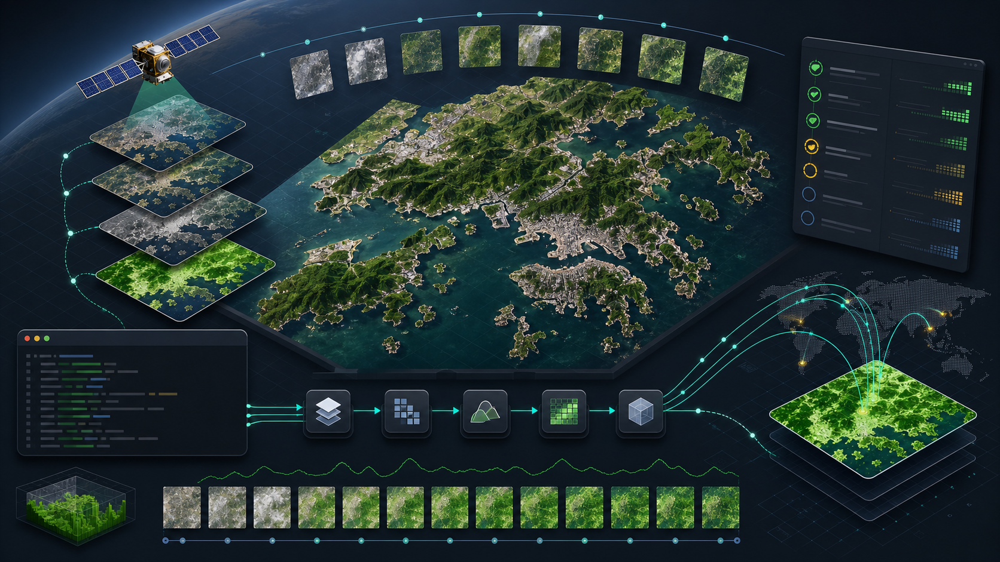
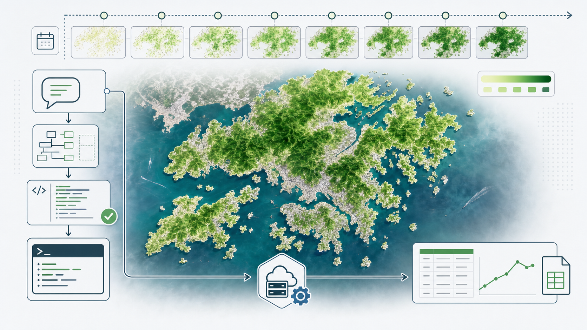

# gee-agent-skill



`gee-agent-skill` is an agent-native command-line harness for Google Earth Engine workflows. It helps Codex or another coding agent turn natural-language geospatial requests into reviewable plans, source-grounded dataset/operator choices, validated Earth Engine Python scripts, safe preflight checks, explicit user-confirmed exports, export monitoring, and reproducible traces.

The project works on Windows and macOS when commands are run from the repository root inside an activated virtual environment.

## Table of Contents

- [What this project does](#what-this-project-does)
- [Release readiness](#release-readiness)
- [Quick Start](#quick-start)
- [Configuration checklist](#configuration-checklist)
- [Installation](#installation)
  - [Windows PowerShell](#windows-powershell)
  - [macOS / Linux zsh or bash](#macos--linux-zsh-or-bash)
- [Earth Engine authentication](#earth-engine-authentication)
  - [Windows PowerShell](#earth-engine-authentication-windows-powershell)
  - [macOS / Linux](#earth-engine-authentication-macos--linux)
  - [Verified macOS OAuth flow](#verified-macos-oauth-flow)
- [Run without Earth Engine credentials](#run-without-earth-engine-credentials)
- [Run the demo](#run-the-demo)
- [Demo output: v0.3 CSV](#demo-output-v03-csv)
- [How the plan-first workflow works](#how-the-plan-first-workflow-works)
- [Common mistakes and fixes](#common-mistakes-and-fixes)
- [Repository structure](#repository-structure)
- [References and data sources](#references-and-data-sources)
- [Security and credentials](#security-and-credentials)

## What this project does

The skill provides a CLI-first path for Earth Engine work:

- convert a natural-language request into a reviewable plan;
- search local Earth Engine notes, dataset cards, operator rules, and failure guidance;
- render approved Jinja2 Earth Engine Python templates;
- validate generated scripts before live use;
- run dry-runs and data preflight checks before export;
- submit live exports only after an explicit `--confirm-live` gate;
- monitor export tasks and write trace artifacts under `outputs/runs/<run_id>/`.

At a glance:

| Stage | What happens |
| --- | --- |
| 🧭 Natural language | A user or agent writes a request such as `Compute 16-day NDVI for Hong Kong in 2024 and export CSV.` |
| 📄 v0.3 plan | The CLI parses AOI, time range, metric, cadence, output type, dataset candidates, rules, and template choice into editable YAML. |
| 🧩 Python render | A reviewed Jinja2 template becomes an Earth Engine Python script with stable constants and export selectors. |
| ✅ Validation | Static and semantic checks block unresolved templates, missing imports, unsafe exports, wrong bands, and missing reducers before live use. |
| 🌐 Live preflight | Earth Engine is contacted to verify auth/project, AOI, image counts, required bands, and small sanity statistics. |
| 📤 Export | Only `run-plan --confirm-live` starts `ee.batch.Export.table.toDrive(...).start()`. |
| 📊 Monitor | `monitor-exports` reports task id, description, state, timestamps, and errors. |

The Hong Kong NDVI workflows are golden examples for the general harness, not the full product boundary:

1. v0.1: January 2024 mean NDVI for Hong Kong.
2. v0.2: January 2024 Hong Kong NDVI by land-cover class.
3. v0.3: 2024 16-day Hong Kong NDVI CSV workflow.



This project is not a credentials provider, a GUI replacement for Earth Engine, or a source of scientific conclusions without domain review.

## Release readiness

The current publishability checklist is tracked in [Release readiness](docs/release_readiness.md). It records:

- homepage visuals generated with imagegen and saved under `assets/images/`;
- Browser and Computer Use boundaries for agent workflows;
- CLI contract coverage for `info`, `doctor`, `catalog`, `recipe`, `rules`, and `plan`;
- the Hong Kong 2024 16-day NDVI example and its render/validation commands;
- corpus policy for `giswqs`/OpenGeo, `gee-community`, and paper-linked GEE repositories;
- validation commands and remaining limitations.


## Quick Start

First clone the repository or enter your existing local checkout.

```bash
git clone https://github.com/Fwrog/gee-agent-skill.git
cd gee-agent-skill
```

If you already have the repository, enter the project root first:

```bash
cd /path/to/gee-agent-skill
```

You should see:

```text
pyproject.toml
README.md
SKILL.md
src/
assets/
docs/
```

If `pyproject.toml` is not present, you are not in the correct directory. Do not run `pip install -e ".[earthengine]"` from your home directory.

After you are in the repository root, use the installation section for your shell.

## Configuration checklist

Most setup problems come from shell state rather than from Earth Engine itself. Before debugging GEE, verify this checklist in order.

1. You are inside the repository root, not your home directory.

```bash
pwd
ls pyproject.toml
```

PowerShell:

```powershell
Get-Location
dir pyproject.toml
```

If `pyproject.toml` is missing, run `cd /path/to/gee-agent-skill` first. A directory path by itself is not a command; use `cd /path/to/gee-agent-skill`, not `/path/to/gee-agent-skill`.

2. You are using the project virtual environment.

macOS / Linux:

```bash
source .venv/bin/activate
which python
which earthengine
```

Windows PowerShell:

```powershell
.\.venv\Scripts\Activate.ps1
where python
where earthengine
```

Expected paths should point into this repository's `.venv`. If Anaconda shows `(base)`, that is acceptable only when `python` and `earthengine` still resolve to the project `.venv`.

3. Install from the project root with the active environment.

```bash
python -m pip install --upgrade pip
python -m pip install -e ".[earthengine]"
python -c "import ee; print('ee import ok')"
earthengine -h
```

If `earthengine` is missing, the active environment either does not have `earthengine-api` installed or was not activated.

4. Keep OS-specific environment variable syntax separate.

Windows PowerShell:

```powershell
$env:EE_PROJECT="your-google-cloud-project-id"
```

macOS / Linux:

```bash
export EE_PROJECT="your-google-cloud-project-id"
```

5. Separate local dry-runs from live Earth Engine access.

Dry-runs and plan commands do not need Google credentials. Live commands need a registered Earth Engine account, a Google Cloud Project, local OAuth, `--project`, and explicit `--confirm-live`.

## Installation

Install from the repository root, not from your home directory. Prefer `python -m pip ...` so the active virtual environment is unambiguous.

For contributors who need tests and build tools, install `".[dev,earthengine]"` instead of only `".[earthengine]"`.

### Windows PowerShell

```powershell
cd E:\projects\gee-agent-skill

python -m venv .venv
.\.venv\Scripts\Activate.ps1

python -m pip install --upgrade pip
python -m pip install -e ".[earthengine]"

where python
where earthengine
python -c "import ee; print('ee import ok')"
earthengine -h
```

Expected paths should point into `.venv`, for example:

```text
E:\projects\gee-agent-skill\.venv\Scripts\python.exe
E:\projects\gee-agent-skill\.venv\Scripts\earthengine.exe
```

`(base)` can appear if Anaconda is active. The important part is that `python` and `earthengine` resolve to the project `.venv`.

### macOS / Linux zsh or bash

```bash
cd /Users/yikai/Documents/GitHub/gee-agent-skill
# or:
# cd ~/Documents/GitHub/gee-agent-skill

python3 -m venv .venv
source .venv/bin/activate

python -m pip install --upgrade pip
python -m pip install -e ".[earthengine]"

which python
which earthengine
python -c "import ee; print('ee import ok')"
earthengine -h
```

Expected paths should look like:

```text
.../gee-agent-skill/.venv/bin/python
.../gee-agent-skill/.venv/bin/earthengine
```

## Earth Engine authentication

Live Earth Engine commands require:

1. a registered Earth Engine account;
2. a Google Cloud Project with Earth Engine API access;
3. local OAuth authentication.

本仓库不提供 Google 账号。需要用户自行注册 Earth Engine、配置 Google Cloud project，并在本地认证。不要提交 credentials.

Never commit service account JSON files, OAuth tokens, local credential files, refresh tokens, or credential paths.

### Earth Engine authentication: Windows PowerShell

```powershell
$env:EE_PROJECT="your-google-cloud-project-id"

earthengine authenticate --auth_mode=localhost
earthengine set_project $env:EE_PROJECT

python -c "import os, ee; ee.Initialize(project=os.environ['EE_PROJECT']); print(ee.Number(1).getInfo())"
```

If the last command prints `1`, authentication and project initialization work.

Optional harness check:

```powershell
gee-skill auth check --project $env:EE_PROJECT --json
```

### Earth Engine authentication: macOS / Linux

```bash
export EE_PROJECT="your-google-cloud-project-id"

earthengine authenticate --auth_mode=localhost
earthengine set_project "$EE_PROJECT"

python -c 'import os, ee; ee.Initialize(project=os.environ["EE_PROJECT"]); print(ee.Number(1).getInfo())'
```

If the last command prints `1`, authentication and project initialization work.

Optional harness check:

```bash
gee-skill auth check --project "$EE_PROJECT" --json
```

### Verified macOS OAuth flow

On macOS zsh, `import ee` can succeed before local OAuth credentials exist. In that case, live initialization fails with:

```text
EEException: Please authorize access to your Earth Engine account by running

earthengine authenticate
```

The working sequence is:

```bash
cd /path/to/gee-agent-skill
source .venv/bin/activate

which python
which earthengine
python -c "import ee; print('ee import ok')"

earthengine authenticate --auth_mode=localhost

export EE_PROJECT="your-google-cloud-project-id"
earthengine set_project "$EE_PROJECT"

python -c 'import os, ee; print("EE_PROJECT=", os.environ["EE_PROJECT"]); ee.Initialize(project=os.environ["EE_PROJECT"]); print(ee.Number(1).getInfo())'
```

Expected successful output includes:

```text
.../gee-agent-skill/.venv/bin/python
.../gee-agent-skill/.venv/bin/earthengine
ee import ok
Successfully saved authorization token.
Successfully saved project id
EE_PROJECT= your-google-cloud-project-id
1
```

If the final command prints `1`, local OAuth credentials and the selected Google Cloud Project are ready for live Earth Engine commands.

Do not commit or share OAuth tokens, local credential files, service account JSON files, refresh tokens, or credential paths.

After OAuth works, run live preflight before any export:

```bash
gee-skill plan from-text "Compute 16-day NDVI for Hong Kong in 2024 and export CSV." \
  --out outputs/plans/hk_2024_16day_ndvi.yaml \
  --json

gee-skill preflight-plan outputs/plans/hk_2024_16day_ndvi.yaml --project "$EE_PROJECT" --json
```

Preflight contacts Earth Engine but does not submit an export task.

## Run without Earth Engine credentials

These commands do not contact Earth Engine:

```bash
gee-skill tools
gee-skill smoke-test --json
gee-skill observe "Compute 16-day NDVI for Hong Kong in 2024 and export CSV." --json
gee-skill plan from-text "Compute 16-day NDVI for Hong Kong in 2024 and export CSV." --out outputs/plans/hk_2024_16day_ndvi.yaml --json
gee-skill plan from-yaml outputs/plans/hk_2024_16day_ndvi.yaml --script-out outputs/scripts/hk_2024_16day_ndvi_csv.py --json
```

They are useful for checking local installation, parser behavior, plan creation, template rendering, validation, and trace output before logging into Google.

## Run the demo

This is the current v0.3 editable-plan workflow:

```text
Compute 16-day NDVI for Hong Kong in 2024 and export CSV.
```

It starts from natural language, writes an editable `gee-plan/v0.3` YAML file, renders a Python script, validates locally, performs live preflight, and only then submits one Earth Engine Drive CSV export.

Plan and render without contacting Earth Engine:

```bash
gee-skill observe "Compute 16-day NDVI for Hong Kong in 2024 and export CSV." --json

gee-skill plan from-text "Compute 16-day NDVI for Hong Kong in 2024 and export CSV." \
  --out outputs/plans/hk_2024_16day_ndvi.yaml \
  --json

gee-skill plan review outputs/plans/hk_2024_16day_ndvi.yaml --json

gee-skill plan from-yaml outputs/plans/hk_2024_16day_ndvi.yaml \
  --script-out outputs/scripts/hk_2024_16day_ndvi_csv.py \
  --json

gee-skill validate outputs/scripts/hk_2024_16day_ndvi_csv.py --json
```

Run live preflight after OAuth and project setup:

```bash
gee-skill preflight-plan outputs/plans/hk_2024_16day_ndvi.yaml \
  --project "$EE_PROJECT" \
  --json
```

Preflight contacts Earth Engine but does not submit an export. It checks the Hong Kong AOI, Sentinel-2 SR Harmonized availability, NDVI band creation, and small sanity statistics for January and July anchor months. A passing v0.3 preflight reports `expected_export_rows: 23`.

Submit exactly one reviewed export:

```bash
gee-skill run-plan outputs/plans/hk_2024_16day_ndvi.yaml \
  --project "$EE_PROJECT" \
  --confirm-live \
  --run-id hk-2024-16day-ndvi-v03-live-export-check \
  --json
```

Monitor the task:

```bash
gee-skill monitor-exports --project "$EE_PROJECT" --timeout 0 --json
```

Windows PowerShell equivalents:

```powershell
gee-skill plan from-text "Compute 16-day NDVI for Hong Kong in 2024 and export CSV." `
  --out outputs\plans\hk_2024_16day_ndvi.yaml `
  --json

gee-skill plan review outputs\plans\hk_2024_16day_ndvi.yaml --json

gee-skill plan from-yaml outputs\plans\hk_2024_16day_ndvi.yaml `
  --script-out outputs\scripts\hk_2024_16day_ndvi_csv.py `
  --json

gee-skill preflight-plan outputs\plans\hk_2024_16day_ndvi.yaml `
  --project $env:EE_PROJECT `
  --json

gee-skill run-plan outputs\plans\hk_2024_16day_ndvi.yaml `
  --project $env:EE_PROJECT `
  --confirm-live `
  --run-id hk-2024-16day-ndvi-v03-live-export-check `
  --json

gee-skill monitor-exports --project $env:EE_PROJECT --timeout 0 --json
```

The expected export metadata is:

```text
description: hk_2024_16day_ndvi
Drive folder: gee_exports
file prefix: hk_2024_16day_ndvi
rows: 23
```

## Demo output: v0.3 CSV

This reader-facing demo shows the complete CSV shape produced by the v0.3 Hong Kong 2024 16-day NDVI workflow. It is included so readers can inspect the expected fields, cadence, value ranges, and image-count diagnostics without running Earth Engine first.

Summary:

```text
rows: 23
date coverage: 2024-01-01 to 2025-01-01
mean_ndvi range: -0.066 to 0.358
mean of period means: 0.109
minimum image_count_after_cloud_filter: 2
low-image-count periods: 5, 8
null mean_ndvi rows: 0
```

Full demo CSV:

```csv
aoi_name,year,period_index,date_start,date_end,temporal_cadence_days,mean_ndvi,image_count_before_cloud_filter,image_count_after_cloud_filter,dataset_id,scale_m,crs,aoi_source,export_description
Hong Kong,2024,1,2024-01-01,2024-01-17,16,0.06137939316458223,34,34,COPERNICUS/S2_SR_HARMONIZED,10,EPSG:4326,Home Affairs Department Hong Kong administrative district boundary GeoJSON,hk_2024_16day_ndvi
Hong Kong,2024,2,2024-01-17,2024-02-02,16,0.021682486591865075,34,15,COPERNICUS/S2_SR_HARMONIZED,10,EPSG:4326,Home Affairs Department Hong Kong administrative district boundary GeoJSON,hk_2024_16day_ndvi
Hong Kong,2024,3,2024-02-02,2024-02-18,16,-0.008787025242330054,30,16,COPERNICUS/S2_SR_HARMONIZED,10,EPSG:4326,Home Affairs Department Hong Kong administrative district boundary GeoJSON,hk_2024_16day_ndvi
Hong Kong,2024,4,2024-02-18,2024-03-05,16,0.018605165810100164,36,5,COPERNICUS/S2_SR_HARMONIZED,10,EPSG:4326,Home Affairs Department Hong Kong administrative district boundary GeoJSON,hk_2024_16day_ndvi
Hong Kong,2024,5,2024-03-05,2024-03-21,16,0.3583391891617482,30,2,COPERNICUS/S2_SR_HARMONIZED,10,EPSG:4326,Home Affairs Department Hong Kong administrative district boundary GeoJSON,hk_2024_16day_ndvi
Hong Kong,2024,6,2024-03-21,2024-04-06,16,0.09820961451352254,34,17,COPERNICUS/S2_SR_HARMONIZED,10,EPSG:4326,Home Affairs Department Hong Kong administrative district boundary GeoJSON,hk_2024_16day_ndvi
Hong Kong,2024,7,2024-04-06,2024-04-22,16,0.15836690001841133,30,10,COPERNICUS/S2_SR_HARMONIZED,10,EPSG:4326,Home Affairs Department Hong Kong administrative district boundary GeoJSON,hk_2024_16day_ndvi
Hong Kong,2024,8,2024-04-22,2024-05-08,16,-0.0664235578099966,30,2,COPERNICUS/S2_SR_HARMONIZED,10,EPSG:4326,Home Affairs Department Hong Kong administrative district boundary GeoJSON,hk_2024_16day_ndvi
Hong Kong,2024,9,2024-05-08,2024-05-24,16,0.17030485358920375,39,4,COPERNICUS/S2_SR_HARMONIZED,10,EPSG:4326,Home Affairs Department Hong Kong administrative district boundary GeoJSON,hk_2024_16day_ndvi
Hong Kong,2024,10,2024-05-24,2024-06-09,16,0.25214183736529805,30,6,COPERNICUS/S2_SR_HARMONIZED,10,EPSG:4326,Home Affairs Department Hong Kong administrative district boundary GeoJSON,hk_2024_16day_ndvi
Hong Kong,2024,11,2024-06-09,2024-06-25,16,0.1821216212020888,34,6,COPERNICUS/S2_SR_HARMONIZED,10,EPSG:4326,Home Affairs Department Hong Kong administrative district boundary GeoJSON,hk_2024_16day_ndvi
Hong Kong,2024,12,2024-06-25,2024-07-11,16,0.10028333128041216,32,22,COPERNICUS/S2_SR_HARMONIZED,10,EPSG:4326,Home Affairs Department Hong Kong administrative district boundary GeoJSON,hk_2024_16day_ndvi
Hong Kong,2024,13,2024-07-11,2024-07-27,16,0.25195509572253405,30,19,COPERNICUS/S2_SR_HARMONIZED,10,EPSG:4326,Home Affairs Department Hong Kong administrative district boundary GeoJSON,hk_2024_16day_ndvi
Hong Kong,2024,14,2024-07-27,2024-08-12,16,0.08885762249481123,36,20,COPERNICUS/S2_SR_HARMONIZED,10,EPSG:4326,Home Affairs Department Hong Kong administrative district boundary GeoJSON,hk_2024_16day_ndvi
Hong Kong,2024,15,2024-08-12,2024-08-28,16,0.11989745428671472,30,12,COPERNICUS/S2_SR_HARMONIZED,10,EPSG:4326,Home Affairs Department Hong Kong administrative district boundary GeoJSON,hk_2024_16day_ndvi
Hong Kong,2024,16,2024-08-28,2024-09-13,16,0.15124974656199455,34,20,COPERNICUS/S2_SR_HARMONIZED,10,EPSG:4326,Home Affairs Department Hong Kong administrative district boundary GeoJSON,hk_2024_16day_ndvi
Hong Kong,2024,17,2024-09-13,2024-09-29,16,0.14508491985008928,30,21,COPERNICUS/S2_SR_HARMONIZED,10,EPSG:4326,Home Affairs Department Hong Kong administrative district boundary GeoJSON,hk_2024_16day_ndvi
Hong Kong,2024,18,2024-09-29,2024-10-15,16,0.1376690685869499,30,28,COPERNICUS/S2_SR_HARMONIZED,10,EPSG:4326,Home Affairs Department Hong Kong administrative district boundary GeoJSON,hk_2024_16day_ndvi
Hong Kong,2024,19,2024-10-15,2024-10-31,16,0.100211664616846,35,32,COPERNICUS/S2_SR_HARMONIZED,10,EPSG:4326,Home Affairs Department Hong Kong administrative district boundary GeoJSON,hk_2024_16day_ndvi
Hong Kong,2024,20,2024-10-31,2024-11-16,16,0.005387772561937038,33,16,COPERNICUS/S2_SR_HARMONIZED,10,EPSG:4326,Home Affairs Department Hong Kong administrative district boundary GeoJSON,hk_2024_16day_ndvi
Hong Kong,2024,21,2024-11-16,2024-12-02,16,0.014769201455417689,37,14,COPERNICUS/S2_SR_HARMONIZED,10,EPSG:4326,Home Affairs Department Hong Kong administrative district boundary GeoJSON,hk_2024_16day_ndvi
Hong Kong,2024,22,2024-12-02,2024-12-18,16,0.07812940745081513,40,26,COPERNICUS/S2_SR_HARMONIZED,10,EPSG:4326,Home Affairs Department Hong Kong administrative district boundary GeoJSON,hk_2024_16day_ndvi
Hong Kong,2024,23,2024-12-18,2025-01-01,16,0.07055101818908434,34,24,COPERNICUS/S2_SR_HARMONIZED,10,EPSG:4326,Home Affairs Department Hong Kong administrative district boundary GeoJSON,hk_2024_16day_ndvi
```

Why this demo can look low:

- It is a whole-AOI all-surface mean NDVI example, not a land-only or vegetation-only ecological indicator.
- The curated Hong Kong administrative geometry includes water and dense built-up areas, so period means can be near zero or occasionally negative.
- Periods 5 and 8 have only two images after cloud filtering, so they should be read as lower-confidence demo rows.
- The purpose of this example is to prove the v0.3 agent loop, not to optimize a remote-sensing product:

```text
natural language -> gee-plan/v0.3 YAML -> rendered .py -> validation -> live preflight -> Earth Engine export task -> Drive CSV
```

More refined examples can build on the same adapter pattern:

- land-only NDVI after water masking;
- vegetation-only NDVI using Dynamic World or WorldCover masks;
- district-level 16-day NDVI instead of whole-Hong-Kong aggregation;
- image-count and cloud-confidence diagnostics per period;
- chart-ready CSV plus a quick visual QA report.

## How the plan-first workflow works

The default workflow separates intent interpretation, review, preflight, and live execution.

1. Plan: `gee-skill ask "<request>" --plan --json` writes `outputs/runs/<run_id>/task_plan.yaml` without contacting Earth Engine.
2. Review: `gee-skill review-plan outputs/runs/<run_id>/task_plan.yaml` shows interpreted dates, AOI, datasets, masks, reducers, outputs, and limitations.
3. Preflight: `gee-skill preflight-plan ... --project <id> --json` checks live data availability before export.
4. Run: `gee-skill run-plan ... --project <id> --confirm-live --json` submits an export only after review and confirmation.
5. Monitor: `gee-skill monitor-exports --project <id> --json` checks task states.

For the v0.3 editable-plan path, `plan from-text` and `plan from-yaml` are intentionally separate. The plan is the reviewable contract; the rendered `.py` file is the executable Earth Engine script generated from that contract.

```bash
gee-skill plan from-text "Compute 16-day NDVI for Hong Kong in 2024 and export CSV." \
  --out outputs/plans/hk_2024_16day_ndvi.yaml \
  --json

gee-skill plan from-yaml outputs/plans/hk_2024_16day_ndvi.yaml \
  --script-out outputs/scripts/hk_2024_16day_ndvi_csv.py \
  --json
```

The rendered script uses Sentinel-2 SR Harmonized, the curated Hong Kong district GeoJSON as the whole-Hong-Kong AOI, 16-day periods from `2024-01-01` through `2025-01-01`, SCL masking, `B8/B4` NDVI, server-side reducers, stable CSV selectors, and `task.start()` behind a guarded `main()` entrypoint.

The CLI also writes trace files under `outputs/runs/<run_id>/`, including `task_plan.yaml`, `generated_script.py`, `validation_report.json`, `dry_run_report.json`, `preflight_report.json`, `live_run_report.json`, `export_tasks.json`, and `final_report.md`.

## Common mistakes and fixes

### `file:///Users/<name> does not appear to be a Python project`

Cause: you ran `pip install -e ".[earthengine]"` from your home directory instead of the repository root.

Fix:

```bash
cd /path/to/gee-agent-skill
ls pyproject.toml
python -m pip install -e ".[earthengine]"
```

### `zsh: permission denied: /path/to/gee-agent-skill`

Cause: you typed a directory path as if it were a command.

Fix:

```bash
cd /path/to/gee-agent-skill
```

### `zsh: command not found: earthengine`

Cause: `earthengine-api` is not installed in the active environment, or the venv is not activated.

Fix:

```bash
source .venv/bin/activate
python -m pip install -e ".[earthengine]"
which earthengine
```

### `ModuleNotFoundError: No module named 'geeskill'`

Cause: the console script exists, but the editable install is not visible to the active Python environment. On macOS this can happen if `.venv` files or the editable `.pth` file have the `hidden` file flag.

Fix from the repository root:

```bash
source .venv/bin/activate
chflags -R nohidden .venv
python -m pip install -e ".[earthengine]"
python -c "import geeskill; print(geeskill.__file__)"
```

For one-off source-tree debugging, you can also run the CLI through the checked-out `src/` directory:

```bash
PYTHONPATH=src python -m geeskill.cli info --json
```

Do not use this as a substitute for a correct install in user-facing setup docs.

### `NETWORK_ERROR` during live preflight

Cause: Earth Engine or the OAuth token endpoint had a transient network/TLS failure during live initialization, for example an SSL EOF or `oauth2.googleapis.com` token request failure.

Fix:

```bash
gee-skill auth check --project "$EE_PROJECT" --json
gee-skill preflight-plan outputs/plans/hk_2024_16day_ndvi.yaml --project "$EE_PROJECT" --json
```

The v0.3 preflight adapter retries a retryable anchor-month failure once. If failures persist, confirm normal internet access and Google/Earth Engine service availability before reauthenticating.

### PowerShell uses `$env:EE_PROJECT`, macOS uses `export EE_PROJECT`

Windows:

```powershell
$env:EE_PROJECT="your-project-id"
```

macOS/Linux:

```bash
export EE_PROJECT="your-project-id"
```

## Repository structure

```text
SKILL.md                         Model-facing skill entrypoint
assets/templates/                Jinja2 Earth Engine Python workflow templates
docs/                            Beginner guides, concepts, live workflow notes, troubleshooting
examples/                        Task YAML examples
references/knowledge_base/       Curated docs, dataset cards, operator chains, failure cases
references/boundaries/           Curated Hong Kong district boundary GeoJSON
references/corpus/               Pattern-only GitHub corpus inventories and review notes
references/index/                Generated local retrieval index
src/geeskill/                    CLI, registry, retrieval, validation, runtime, trace code
evals/                           Benchmark suite and contexts
tests/                           Offline regression tests
outputs/runs/                    Generated run traces
```

More documentation:

- [How to start](docs/how_to_start.md)
- [Release readiness](docs/release_readiness.md)
- [Troubleshooting](docs/troubleshooting.md)
- [Harness trace model](docs/harness.md)
- [v0.1 Hong Kong January NDVI workflow](docs/v01_hk_january_ndvi.md)
- [v0.2 land-cover-aware NDVI workflow](docs/v02_landcover_aware_ndvi.md)
- [v0.3 Hong Kong 2024 16-day NDVI workflow](docs/v03_hk_2024_16day_ndvi.md)
- [Extending workflows](docs/extending.md)

## References and data sources

- [Earth Engine Python API](https://developers.google.com/earth-engine/guides/python_install)
- [Earth Engine authentication](https://developers.google.com/earth-engine/guides/auth)
- [Sentinel-2 SR Harmonized](https://developers.google.com/earth-engine/datasets/catalog/COPERNICUS_S2_SR_HARMONIZED)
- [Dynamic World V1](https://developers.google.com/earth-engine/datasets/catalog/GOOGLE_DYNAMICWORLD_V1)
- [ESA WorldCover](https://developers.google.com/earth-engine/datasets/catalog/ESA_WorldCover_v200)
- [geemap](https://geemap.org/)
- [giswqs GitHub](https://github.com/giswqs)
- [GEE Community GitHub](https://github.com/gee-community)

The local knowledge base also contains distilled notes under `references/knowledge_base/`. GitHub repositories listed under `references/corpus/` are used for pattern discovery, not wholesale code copying.

## Security and credentials

本仓库不提供 Google 账号。需要用户自行注册 Earth Engine、配置 Google Cloud project，并在本地认证。不要提交 credentials.

Never commit service account JSON files, OAuth tokens, local credential files, refresh tokens, credential paths, private keys, or client secrets.

Live commands require both a Google Cloud Project and explicit confirmation:

```bash
gee-skill run-plan outputs/runs/<run_id>/task_plan.yaml \
  --project "$EE_PROJECT" \
  --confirm-live \
  --json
```

Dry-run and plan commands are safe to run without credentials.
