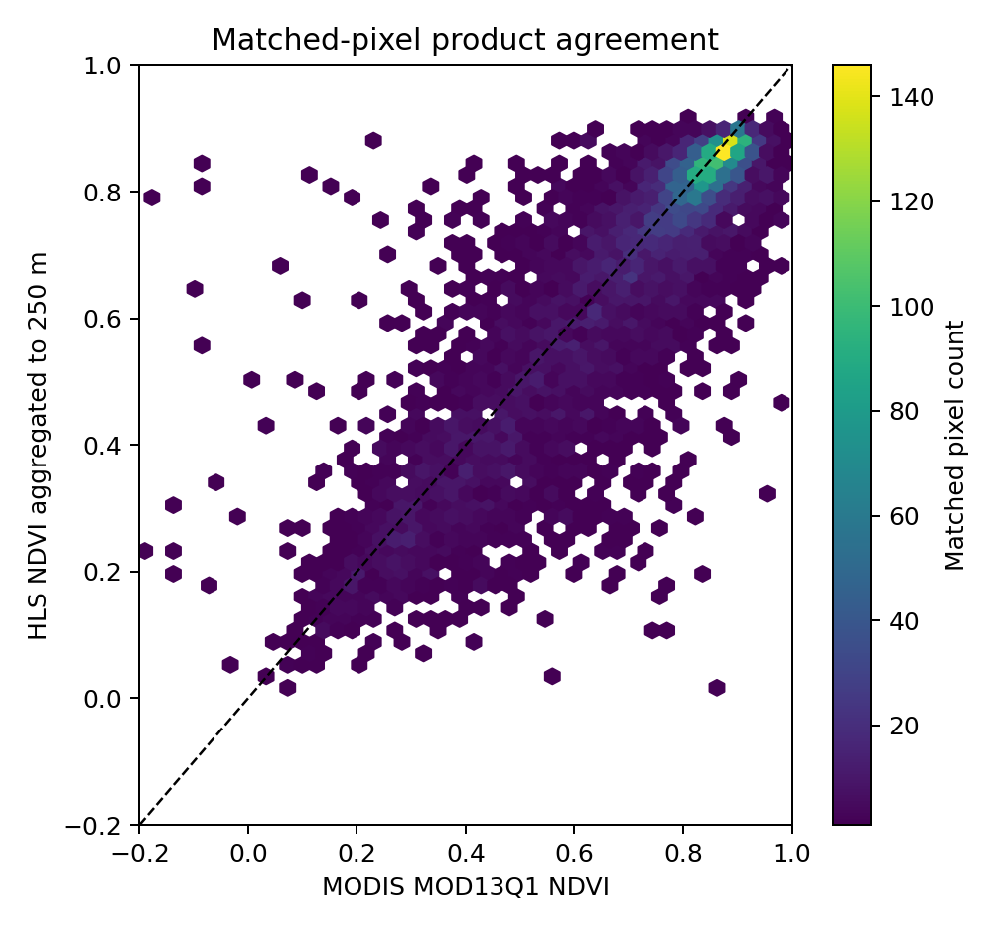

# gee-agent-skill


<p align="center">
  <a href="./README.md">English</a> ·
  <a href="./README.zh-CN.md">简体中文</a> ·
  <a href="https://github.com/Fwrog/gee-agent-skill">GitHub</a>
</p>

<p align="center">
  <a href="https://github.com/Fwrog/gee-agent-skill/actions/workflows/ci.yml"></a>
  
  
  <a href="./LICENSE"></a>
</p>

`gee-agent-skill` is a public Codex skill and Python CLI for building reviewable Google Earth Engine workflows. It turns a geospatial request into a source-grounded plan, validated Earth Engine Python, explicit preflight and live-export gates, monitored tasks, and reproducible run traces.

```text
request -> plan -> evidence -> render -> validate -> preflight -> export -> monitor -> trace
```

## What It Provides

| Surface | Role |
| --- | --- |
| Plan-first CLI | Converts supported requests into editable `gee-plan/v0.3` YAML. |
| Evidence retrieval | Grounds dataset, operator, recipe, rule, and failure choices in a local corpus. |
| Validation gates | Detects unresolved context, unsafe patterns, semantic mismatches, and unsupported claims. |
| Controlled live execution | Requires a project, passing preflight, and explicit `--confirm-live`. |
| Auditable outputs | Persists scripts, evidence, validation, task state, environment data, and final reports. |

This repository is the reusable public harness, not a research workspace. Real project and asset IDs, bucket and object names, task IDs, source rasters, manuscript drafts, and unpublished results stay outside GitHub. Only generic, source-backed lessons are promoted.

## Install

```bash
git clone https://github.com/Fwrog/gee-agent-skill.git
cd gee-agent-skill
python -m venv .venv
python -m pip install -e ".[earthengine]"
gee-skill info --json
gee-skill smoke-test --json
```

Activate `.venv` before installation when your shell requires it. See [How to start](docs/how_to_start.md) for PowerShell and POSIX commands.

To use the repository as a Codex skill, open the checkout as the workspace or ask `$skill-installer` to install the GitHub repository. The agent entry point is [SKILL.md](SKILL.md); UI metadata is in [agents/openai.yaml](agents/openai.yaml).

## Core Workflow

```bash
gee-skill recipe list --json
gee-skill plan from-text "Compute NDVI for a supplied AOI in March 2024 and export CSV." --json
gee-skill render <plan.yaml> --script-out <script.py> --json
gee-skill validate <script.py> --json
gee-skill preflight <plan.yaml> --project <project-id> --json
gee-skill run <plan.yaml> --project <project-id> --confirm-live --json
gee-skill exports list --project <project-id> --json
gee-skill trace inspect <run_id> --json
```

Planning, retrieval, rendering, validation, and offline evaluation do not require Earth Engine credentials. Live work uses the user's own Earth Engine account, Google Cloud Project, local authentication, quota, and export destination.

## Public Evidence

| Capability | Public status | Evidence boundary |
| --- | --- | --- |
| Minimal Sentinel-2 NDVI CSV | Golden | End-to-end public regression path. |
| Land-cover-aware NDVI CSV | Golden | Adds Dynamic World strata with explicit interpretation limits. |
| HLS/MODIS NDVI intercomparison | Golden | Product consistency and workflow reliability, not in-situ accuracy. |
| Annual multi-source transition recipe | Partial | Generic render-and-validate capability; no public live scientific result. |
| Private raster ingestion handoff | Curated workflow | Reusable authority and validation pattern; no private identifiers or data. |

Detailed status lives in the [capability matrix](docs/capability_matrix.md). The full public product-intercomparison method, metrics, figures, and limitations are in the [v0.3 validation report](docs/validation/hk_ndvi_product_intercomparison_v03.md).

The v0.3 `Golden` status is grounded in full-year CSV and annual GeoTIFF Google Drive readback, local QA, and a passing readiness audit. It is product-level consistency evidence, not in-situ ground-truth accuracy.

[](docs/validation/hk_ndvi_product_intercomparison_v03.md)

## Safety And Claim Boundaries

- Never commit credentials, tokens, service-account files, local credential paths, or private keys.
- Never run live exports without reviewed context, preflight, a project, and explicit confirmation.
- Never use overwrite, deletion, public access, or broader IAM as an automatic recovery step.
- Treat exports and model outputs as workflow artifacts, not scientific conclusions or ground truth.
- Call a workflow `live verified` only when the capability matrix records completed public evidence.

See [Security](SECURITY.md), [tool permissions](docs/tool_permissions.md), and the [private-raster handoff](references/knowledge_base/workflows/private-raster-ingestion-handoff.md).

## Documentation

- [CLI reference](docs/cli_reference.md)
- [Recipes](docs/recipes.md)
- [Capability matrix](docs/capability_matrix.md)
- [KG-RAG architecture](docs/kg_rag_architecture.md)
- [Benchmark protocol](docs/benchmark_protocol.md)
- [Remote-sensing validation](docs/remote_sensing_validation.md)
- [Troubleshooting](docs/troubleshooting.md)
- [Release readiness](docs/release_readiness.md)

Official Earth Engine documentation and Data Catalog pages remain canonical for API behavior, dataset identifiers, bands, scale factors, projections, quotas, and export semantics.

## Release And Contribution

Current release: [v0.4.2 notes](docs/releases/v0.4.2.md). Run the local release gates before publishing:

```bash
python -m pytest
python scripts/ingest_docs.py
python scripts/release_gate_kg_rag.py --json
python -m build --sdist --wheel
```

Use [CONTRIBUTING.md](CONTRIBUTING.md), the issue templates under `.github/ISSUE_TEMPLATE/`, and [TODO.md](TODO.md) for public contributions. This project is released under the [MIT License](LICENSE).
