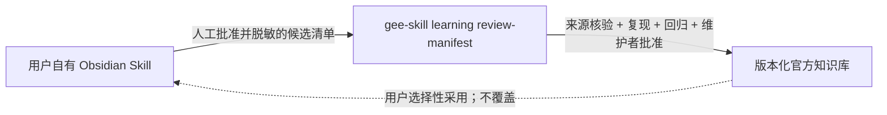

# gee-agent-skill


<p align="center">
  <a href="./README.md">English</a> ·
  <a href="./README.zh-CN.md">简体中文</a> ·
  <a href="https://github.com/Fwrog/gee-agent-skill">GitHub</a>
</p>

<p align="center">
  <a href="https://github.com/Fwrog/gee-agent-skill/actions/workflows/ci.yml"></a>
  
  
  <a href="./LICENSE"></a>
</p>

`gee-agent-skill` 是一个面向 Codex 的公开 Skill 和 Python CLI，用于构建可审查的 Google Earth Engine 工作流。它把地理空间请求转换为有来源依据的计划、经过验证的 Earth Engine Python、显式的 preflight 与 live-export 门控、可监控任务和可复现运行记录。

```text
请求 -> 计划 -> 证据 -> 渲染 -> 验证 -> preflight -> 导出 -> 监控 -> trace
```

## 核心能力

| 能力面 | 作用 |
| --- | --- |
| Plan-first CLI | 把支持的请求转换为可编辑的 `gee-plan/v0.3` YAML。 |
| 证据检索 | 从本地语料中检索数据集、算子、配方、规则和失败案例。 |
| 验证门控 | 发现未解决上下文、不安全模式、语义不匹配和不受支持的结论。 |
| 受控 live 执行 | 要求项目、通过 preflight，并显式使用 `--confirm-live`。 |
| 可审计输出 | 持久化脚本、证据、验证结果、任务状态、环境信息和最终报告。 |

本仓库是可复用的公开 harness，不是具体研究工作区。真实项目和 asset ID、bucket 与 object 名称、task ID、源栅格、论文草稿和未发布结果都应留在 GitHub 之外；只有通用且有来源依据的经验可以进入公开仓库。

## 安装

```bash
git clone https://github.com/Fwrog/gee-agent-skill.git
cd gee-agent-skill
python -m venv .venv
python -m pip install -e ".[earthengine]"
gee-skill info --json
gee-skill smoke-test --json
```

如果当前 shell 需要，请先激活 `.venv`。PowerShell 与 POSIX 的完整命令见 [快速开始](docs/how_to_start.md)。

作为 Codex Skill 使用时，可以直接把仓库检出目录作为工作区打开，或让 `$skill-installer` 从该 GitHub 仓库安装。Agent 入口是 [SKILL.md](SKILL.md)，界面元数据位于 [agents/openai.yaml](agents/openai.yaml)。

## 标准工作流

```bash
gee-skill recipe list --json
gee-skill plan from-text "Compute NDVI for a supplied AOI in March 2024 and export CSV." --json
gee-skill render <plan.yaml> --script-out <script.py> --json
gee-skill validate <script.py> --json
gee-skill preflight <plan.yaml> --project <project-id> --json
gee-skill run <plan.yaml> --project <project-id> --confirm-live --json
gee-skill exports list --project <project-id> --json
gee-skill trace inspect <run_id> --json
```

计划、检索、渲染、验证和离线评测不需要 Earth Engine 凭证。Live 工作使用用户自己的 Earth Engine 账户、Google Cloud Project、本地认证、配额和导出位置。

## 官方知识库 + 用户学习层

本版本加入双层学习架构：仓库维护经过审阅和版本发布的官方公共知识库；每位用户可以另外维护自己的 Obsidian 或 Markdown Skill，用来保存私有证据、个人规则和真实项目错题。



两层之间只通过显式审阅接口连接：

```bash
gee-skill learning contract --json
gee-skill learning review-manifest <promotion-manifest.json> --json
```

清单校验通过只表示它满足传输与隐私契约，不代表本地经验已经成为官方知识。公开 Skill 不读取原始 vault，官方版本也不会覆盖用户自己的笔记或配置。详细协议见[用户本地学习层](references/knowledge_base/workflows/user-local-learning-overlay.md)和[候选提升 schema](schemas/mistake-promotion-manifest-v0.1.schema.json)。

## 公开证据

| 能力 | 公开状态 | 证据边界 |
| --- | --- | --- |
| 最小 Sentinel-2 NDVI CSV | Golden | 公开的端到端回归路径。 |
| 土地覆盖感知 NDVI CSV | Golden | 加入 Dynamic World 分层，并保留解释限制。 |
| HLS/MODIS NDVI 产品互检 | Golden | 证明产品一致性和工作流可靠性，不等同于原位精度。 |
| 年度多源转移配方 | Partial | 通用 render-and-validate 能力；没有公开 live 科学结果。 |
| 私有栅格接力流程 | Curated workflow | 通用权限与验证模式；不包含私有标识或数据。 |

详细状态见 [能力矩阵](docs/capability_matrix.md)。公开产品互检的完整方法、指标、图表和局限见 [v0.3 验证报告](docs/validation/hk_ndvi_product_intercomparison_v03.md)。

v0.3 的 `Golden` 状态以全年 CSV、年度 GeoTIFF 的 Google Drive 回读、本地 QA 和通过的 readiness audit 为依据；这是产品级一致性证据，不是 in-situ ground-truth accuracy。

[](docs/validation/hk_ndvi_product_intercomparison_v03.md)

## 安全与结论边界

- 不提交凭证、token、service-account 文件、本地凭证路径或私钥。
- 未经过上下文审查、preflight、项目指定和显式确认时，不运行 live export。
- 不把覆盖、删除、公开访问或扩大 IAM 权限作为自动恢复步骤。
- 把导出和模型输出视为工作流产物，而不是科学结论或 ground truth。
- 只有能力矩阵记录了完整公开证据时，才能称为 `live verified`。

进一步阅读 [安全策略](SECURITY.md)、[工具权限](docs/tool_permissions.md)和[私有栅格接力流程](references/knowledge_base/workflows/private-raster-ingestion-handoff.md)。

## 文档

- [CLI 参考](docs/cli_reference.md)
- [配方](docs/recipes.md)
- [能力矩阵](docs/capability_matrix.md)
- [KG-RAG 架构](docs/kg_rag_architecture.md)
- [用户本地学习层](references/knowledge_base/workflows/user-local-learning-overlay.md)
- [评测协议](docs/benchmark_protocol.md)
- [遥感验证](docs/remote_sensing_validation.md)
- [故障排查](docs/troubleshooting.md)
- [发布就绪检查](docs/release_readiness.md)

Earth Engine 的 API 行为、数据集 ID、波段、比例因子、投影、配额和导出语义，仍以官方文档和 Data Catalog 为准。

## 发布与贡献

当前版本：[v0.4.3 发布说明](docs/releases/v0.4.3.md)。发布前从仓库根目录运行：

```bash
python -m pytest
python scripts/ingest_docs.py
python scripts/release_gate_kg_rag.py --json
python -m build --sdist --wheel
```

公开贡献请参考 [CONTRIBUTING.md](CONTRIBUTING.md)、`.github/ISSUE_TEMPLATE/` 下的模板和 [TODO.md](TODO.md)。本项目采用 [MIT License](LICENSE)。
